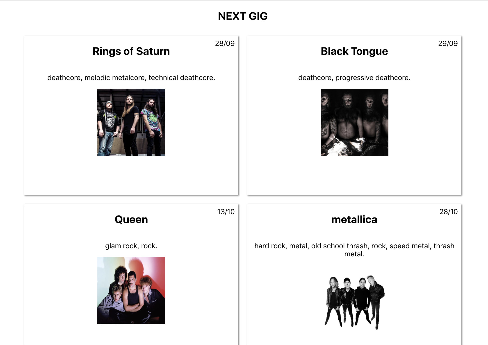

### Next Gig

## WIP

Edit the siteLayout file to add your next gig! This project queries the spotify API to get information on the band entered in the siteLayout file.

The Layout is determined via an editable Javascript object and render using React.

### Current options

component: This is the component that the app will render. At the moment the only options are Tile and Lobby.

#### Props

Title: The name of the band you want to add. This is used in the query string that hits the spotify api

Date: The date of the show you are going to. This does not change the order of the tiles (yet)

### Preview

